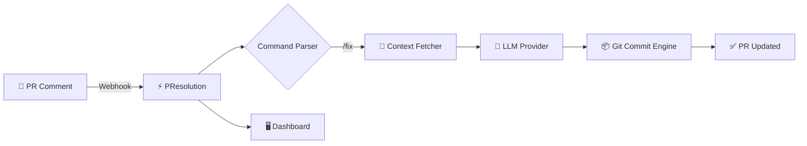

<div align="center">

# ⚡ PResolution

### Autonomous PR Resolution Agent

**AI-powered code fixes from pull request review comments.**
One command to fix them all.

[](https://www.typescriptlang.org/)
[](https://probot.github.io/)
[](#-setup)
[](LICENSE)
[](test/)

---

**Stop context-switching for minor PR fixes.**
PResolution reads reviewer feedback, generates the exact code fix with AI,
and commits it directly to the PR branch — all from a single comment.

</div>

---

## 🎬 How It Works

```
1. A reviewer comments: "This will crash if the array is empty."

2. You reply: @PResolve /fix

3. PResolution:
   📖 Reads the review comment
   📂 Fetches the file content and diff
  🧠 Sends context to configured LLM provider
   ✍️ Generates the corrected code
   📦 Commits directly to the PR branch

4. ✅ Fix committed in < 30 seconds
```

## 🏗️ Architecture



**The full pipeline:**

| Module | Purpose |
|--------|---------|
| `commandParser.ts` | Detects `@PResolve /fix` trigger commands |
| `contextFetcher.ts` | Fetches PR diff, file content, review thread |
| `aiEngine.ts` | Constructs prompts, calls configured provider, validates fixes |
| `commitEngine.ts` | Creates blob → tree → commit → ref update via Git Database API |
| `replyHandler.ts` | Posts status comments with commit links |

## 🚀 Quick Start

### Prerequisites

- **Node.js** ≥ 20.0.0
- A **GitHub App** with the right permissions (see [Setup Guide](#-setup))
- One supported LLM provider:
  - Gemini (`AI_PROVIDER=gemini` + `GEMINI_API_KEY`)
  - OpenAI (`AI_PROVIDER=openai` + `OPENAI_API_KEY`)
  - GitHub Models/OpenAI-compatible (`AI_PROVIDER=github-models` + `GITHUB_TOKEN`, optional `OPENAI_BASE_URL`)

### Install & Run

```bash
# Clone
git clone https://github.com/Anandb71/Pres.git
cd PResolution

# Install dependencies
npm install

# Configure
cp .env.example .env
# Edit .env with your credentials

# Run in development
npm run dev
```

## ⚙️ Setup

### 1. Create a GitHub App

Go to [github.com/settings/apps/new](https://github.com/settings/apps/new):

**Permissions:**
| Permission | Access |
|-----------|--------|
| Pull Requests | Read & Write |
| Contents | Read & Write |
| Issues | Read & Write |
| Metadata | Read |

**Subscribe to events:** `Issue comment`, `Pull request review comment`

### 2. Configure Environment

```env
APP_ID=your_app_id
PRIVATE_KEY_PATH=./private-key.pem
WEBHOOK_SECRET=your_webhook_secret

# Choose one provider
AI_PROVIDER=gemini
GEMINI_API_KEY=your_gemini_api_key

# OR
# AI_PROVIDER=openai
# OPENAI_API_KEY=your_openai_api_key

# OR (Groq, OpenAI-compatible)
# AI_PROVIDER=openai-compatible
# OPENAI_BASE_URL=https://api.groq.com/openai/v1
# OPENAI_API_KEY=your_groq_api_key
# AI_MODEL=openai/gpt-oss-120b

# OR (GitHub Models / OpenAI-compatible)
# AI_PROVIDER=github-models
# GITHUB_TOKEN=your_github_token
# OPENAI_BASE_URL=https://models.inference.ai.azure.com
```

### 3. Install on Repos

Go to your GitHub App's page → **Install App** → select repositories.

## 💡 Usage

### Fix a review comment
```
@PResolve /fix
```

### Fix with extra instructions
```
@PResolve /fix also add input validation
```

### Standalone commands
```
/fix
/resolve
/explain
```

## 🧪 Testing

```bash
# Run all tests
npm test

# Watch mode
npm run test:watch
```

**Test coverage:** 41 tests across 4 test files:
- `commandParser.test.ts` — 21 tests (trigger patterns, edge cases)
- `utils.test.ts` — 15 tests (utilities, activity log)
- `aiEngine.test.ts` — 3 tests (provider integration, mocked)
- `commitEngine.test.ts` — 2 tests (full Git Database API flow, mocked)

## 🖥️ Dashboard

PResolution includes a premium web dashboard:

- **Landing Page** — Hero, terminal demo, features, stats
- **Activity Dashboard** — Real-time fix log with commit links
- **Setup Guide** — Step-by-step installation walkthrough

Visit `http://localhost:3000` when the bot is running.

## 📁 Project Structure

```
PResolution/
├── src/
│   ├── index.ts              # Probot entry point + pipeline orchestration
│   ├── commandParser.ts      # Command detection & parsing
│   ├── contextFetcher.ts     # PR data fetching via Octokit
│   ├── aiEngine.ts           # LLM provider integration (Gemini/OpenAI-compatible)
│   ├── commitEngine.ts       # Git Database API commit flow
│   ├── replyHandler.ts       # PR comment status updates
│   ├── types.ts              # Shared TypeScript interfaces
│   ├── utils.ts              # Utilities & activity log
│   └── dashboard/
│       ├── server.ts          # Express routes
│       ├── public/style.css   # Premium design system
│       └── views/             # EJS templates
│           ├── index.ejs      # Landing page
│           ├── dashboard.ejs  # Activity dashboard
│           └── setup.ejs      # Setup guide
├── test/
│   ├── commandParser.test.ts
│   ├── aiEngine.test.ts
│   ├── commitEngine.test.ts
│   └── utils.test.ts
├── app.yml                    # GitHub App manifest
├── package.json
├── tsconfig.json
└── vitest.config.ts
```

## 🚢 Deployment

### Render (Recommended — free tier available)

A `render.yaml` is included for one-click Infrastructure-as-Code deployment.

#### Step 1 — Push to GitHub
Make sure your code is on the `main` branch of a GitHub repo.

#### Step 2 — Create a new Web Service on Render
1. Go to [dashboard.render.com](https://dashboard.render.com) → **New → Web Service**
2. Connect your GitHub repo (`Anandb71/Pres`)
3. Render auto-detects `render.yaml` — accept the settings

#### Step 3 — Set environment variables
In the Render dashboard → **Environment → Environment Variables**, add:

| Variable | Value |
|----------|-------|
| `NODE_ENV` | `production` |
| `APP_ID` | Your GitHub App ID |
| `PRIVATE_KEY` | **Full contents of your `.pem` file** (paste multi-line in UI) |
| `WEBHOOK_SECRET` | Your webhook secret |
| `AI_PROVIDER` | `openai-compatible` (for Groq) |
| `OPENAI_BASE_URL` | `https://api.groq.com/openai/v1` |
| `OPENAI_API_KEY` | Your Groq API key |
| `AI_MODEL` | `openai/gpt-oss-120b` |
| `DASHBOARD_ACCESS_TOKEN` | `openssl rand -hex 32` |

> **`PRIVATE_KEY` tip:** Open your `.pem` file, select all, and paste directly into the Render UI — it handles multi-line values correctly. Do **not** set `PRIVATE_KEY_PATH` on Render.

> **PORT:** Do **not** set `PORT` — Render injects it automatically.

#### Step 4 — Update your GitHub App webhook URL
After first deploy, copy your Render service URL (e.g. `https://presolution.onrender.com`) and set it as the **Webhook URL** in your GitHub App settings: `https://presolution.onrender.com/`

#### Step 5 — Done
Push a commit → Render auto-deploys. Your webhook URL is live and the bot is running.

---

### Other platforms

| Platform | Notes |
|----------|-------|
| [Railway](https://railway.app) | One-click deploy; same env vars apply |
| [Fly.io](https://fly.io) | Global edge; use `fly launch` |

**All platforms:** same env vars, `npm install && npm run build` for build, `npm start` to run. `PRIVATE_KEY` (env var) is always safer than `PRIVATE_KEY_PATH` on cloud hosts.

## 🤝 Contributing

1. Fork the repo
2. Create a feature branch: `git checkout -b feature/amazing`
3. Make your changes and add tests
4. Run `npm test` to verify
5. Submit a PR

## 📄 License

MIT © [Anand](https://github.com/anandb71)

---

<div align="center">
  <strong>Built with ⚡ by Anand — Powered by Probot & pluggable LLM providers</strong>
</div>
